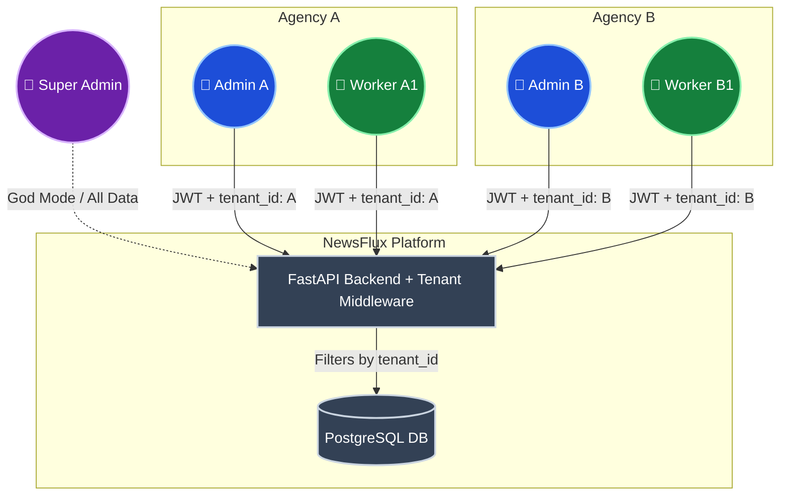
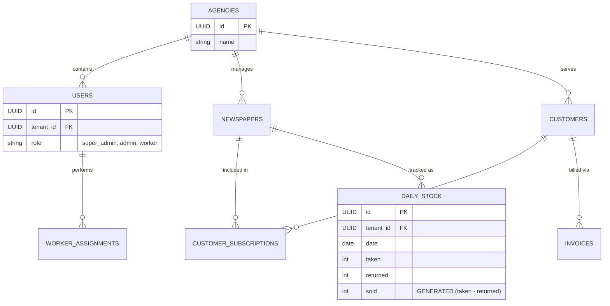
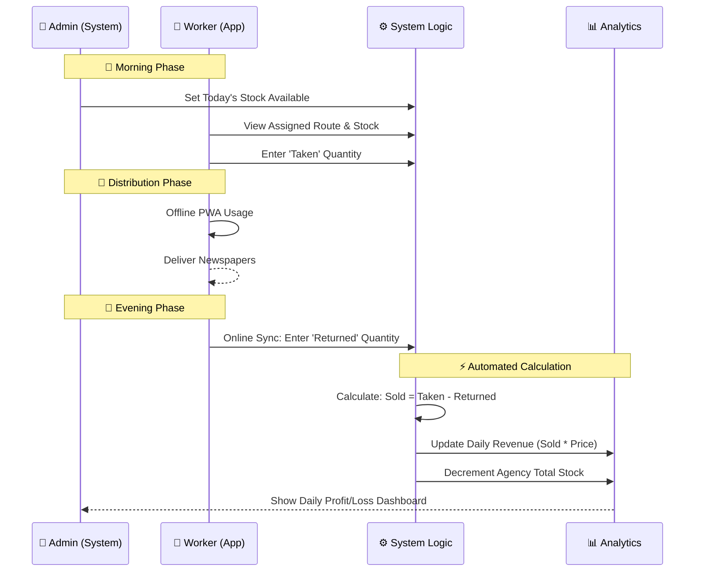
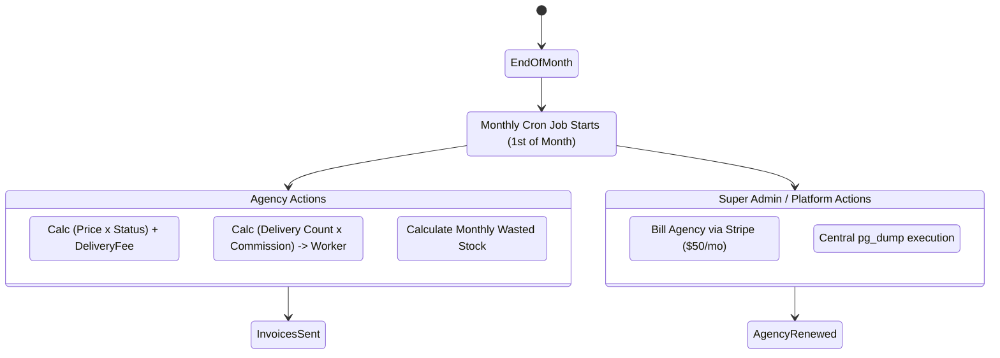

# 📊 NewsFlux: System Architecture & Flow Diagrams

This document contains visual representations of the NewsFlux Multi-Tenant SaaS platform, including the database schema, role-based workflows, and daily distribution logic.

---

## 🏗️ 1. Multi-Tenant Architecture (Shared Schema)

The core structure demonstrating how a single backend and database securely handle multiple isolated agencies using a strict `tenant_id` filter.

---

## 🗄️ 2. Core Entity Relationship Diagram (ERD)

A simplified view of the database tables, emphasizing how every major entity is tied to its originating agency.

---

## 🔄 3. Daily Operations Workflow

The day-to-day cycle showing how stock moves from the Admin to the Worker, resulting in calculated sales and analytics.

---

## 📅 4. Monthly SaaS & Billing Cycle

How the system handles complex monthly operations, protecting both the agency and the platform owner.

