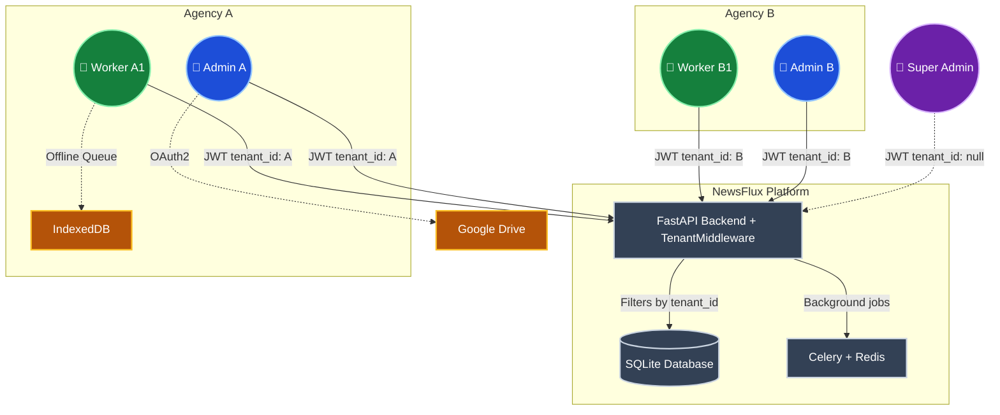
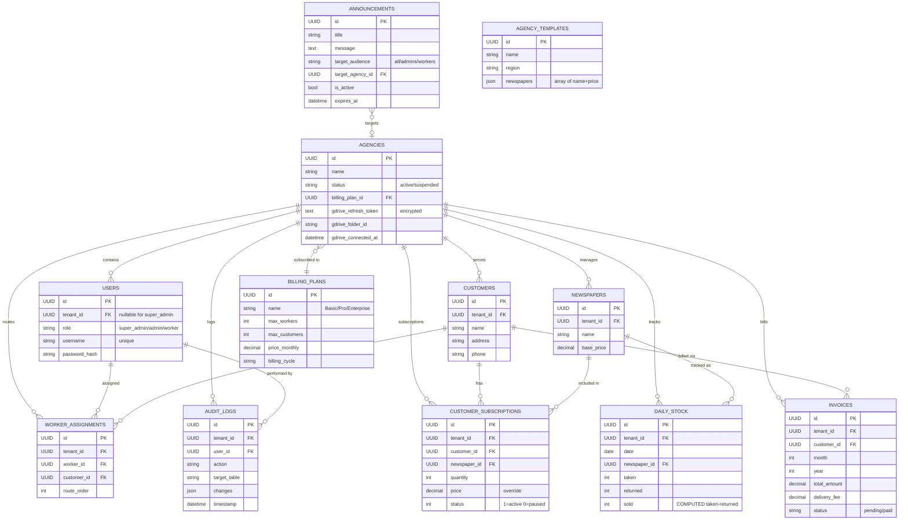
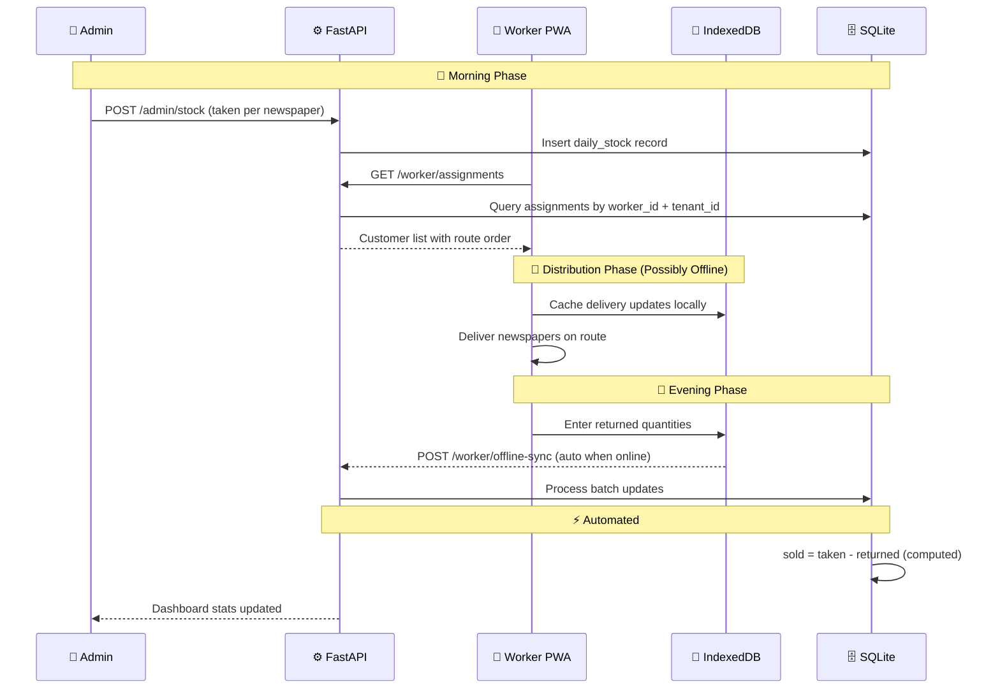
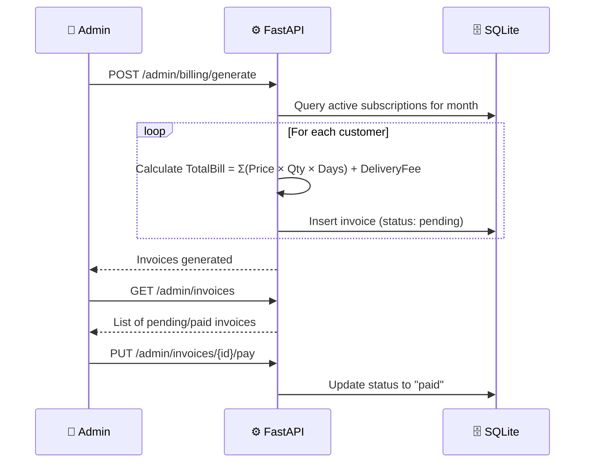
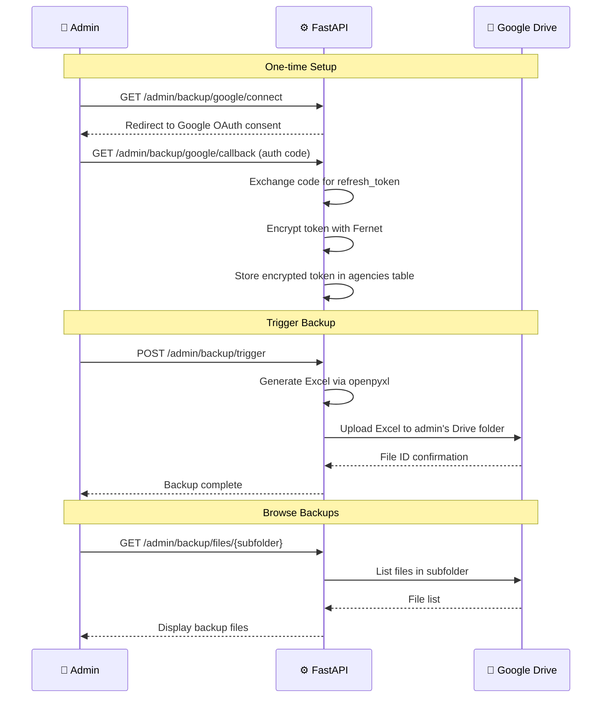
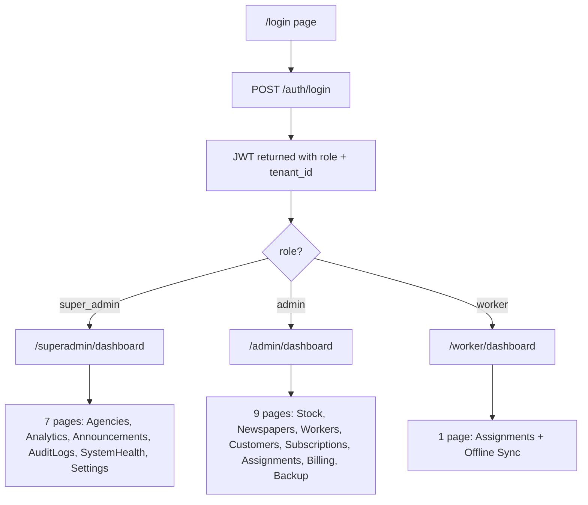
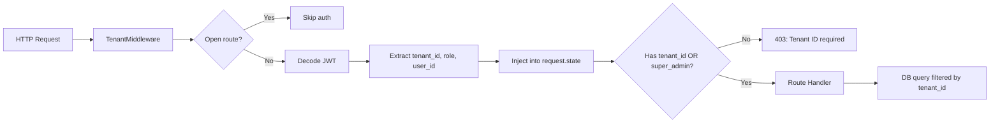

# 📊 NewsFlux: System Architecture & Flow Diagrams

Visual representations of the NewsFlux Multi-Tenant SaaS platform architecture, database schema, and operational workflows.

---

## 🏗️ 1. Multi-Tenant Architecture (Shared Schema)

Single backend and SQLite database securely handling multiple isolated agencies via `tenant_id` filtering in TenantMiddleware.

---

## 🗄️ 2. Entity Relationship Diagram (12 Tables)

Complete ERD showing all implemented tables and their relationships.

---

## 🔄 3. Daily Operations Workflow

Day-to-day cycle: stock entry → distribution → sync → calculation.

---

## 📅 4. Monthly Billing Cycle

---

## 💾 5. Google Drive Backup Flow

---

## 🔐 6. Authentication & Role Routing

---

## 🛡️ 7. Tenant Isolation Flow

